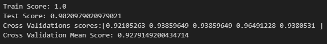

# Modelando a previsando da ocorrência de um tumor de mama maligno com foco na etapa de Model Evaluation

## Objetivos e Motivação

Neste projeto, criamos um modelo de previsão para diagnosticar se um tumor é benigno ou maligno, a partir de diferentes características dadas. Nosso foco é na etapa de Model Evaluation, onde analisamos diferentes métricas para manter nosso modelo mais adequado ao diagnóstico de um câncer de mama.

## Objeto de Estudo

### Model Evaluation

No processo de Model Evaluation, queremos analisar quão bem um modelo resolve nosso problema, analisamos diferentes formas de ajustar os seus hiperparâmetros, bem como o comportamento das nossas métricas de resultado. Este tipo de processo ocorre normalmente quando erros do Tipo 1 possuem gravidade diferente do Erro do Tipo 2, e vice-versa. Dessa forma, se vê necessário ajustar os parâmetros para evitar mais ocorrências de um do que do outro.

### Dataset

O Dataset utilizado é um famoso Dataset contendo 30 características e 1 variável target binária. Ele pode ser acessado diretamente da biblioteca do Sklearn, assim como, suas informações são encontradas neste link: https://archive.ics.uci.edu/dataset/17/breast+cancer+wisconsin+diagnostic

Este dataset possui dados reais computados a partir de uma imagem digitalizada de uma aspiração por agulha fina (FNA) de uma massa mamária, Eles descrevem características dos núcleos celulares presentes na imagem.

Desta forma, possuímos 3 grupos de 10 características, esses grupos são a média, o erro padrão e o "pior", sendo o último a média dos 3 piores valores. As 10 características são listadas abaixo:

1. radius (mean of distances from center to points on the perimeter)
2. texture (standard deviation of gray-scale values)
3. perimeter
4. area
5. smoothness (local variation in radius lengths)
6. compactness (perimeter^2 / area - 1.0)
7. concavity (severity of concave portions of the contour)
8. concave points (number of concave portions of the contour)
9. symmetry
10. fractal dimension ("coastline approximation" - 1)

## Método

Nosso método segue os seguintes passos:

- Importação, entendimento e tratamento básico do Dataset
- Estudo de correlação
- Separação em Treino e Teste
- Análise da distribuição e escalonamento das nossas características
- Modelagem e comparação de resultados por validação cruzada (Regressão Logística, Árvore de Decisão, Máquinas de vetores suporte)
- Análise de Importância das características
- Revalidação do Modelo com o novo conjunto selecionado de características
- Ajuste a partir da análise da Matriz de confusão e suas métricas relacionadas
  

## Desenvolvimento

### Importação, entendimento e tratamento básico do Dataset

Com o Dataset importado, utilizamos a função .info() para checar informações como tipo de cada feature e checagem de valores nulos.


Vemos que não possuímos valores nulos e nosso único valor em formato string é nossa variável alvo. Além disso possuímos duas colunas chamadas "id" e "Unnamed: 32", da qual formulamos a hipótese de não nos trazer informação relevante.

A função .describe().T nos traz informações como os quartis, o máximo, mínimo, média e desvio padrão das características, porém a quantidade de características do dataset impede a visualização clara dessas variáveis. Por isso, damos mais atenção a distribuição das características mais adiante.

### Estudo de correlação

É importante ressaltar que nesta etapa, nos atentaremos apenas a correlação das nossas características com nossa variável alvo. Correlação das características entre si e multicolinearidade pode ter um impacto na interpretabilidade do modelo e em alguns casos até em seu score e deve ser um passo a ser executado em um projeto completo de modelagem. Para isso se recomenda o uso de VIF, "Variance Influence Factor", que quantifica a gravidade de uma multicolinearidade para o modelo.

Para realizar a análise plotamos a matriz de correlação e filtramos apenas a linha da variável alvo.

``````python
correlation_matrix = df.corr()

correlation_with_diagnosis = correlation_matrix.loc['diagnosis']

plt.figure(figsize=(8, 6))
sns.heatmap(correlation_with_diagnosis.to_frame(), annot=True, fmt='.2f', cmap = 'gist_gray', yticklabels=1)
plt.title("Linear Correlation between Features and Target")
plt.show()
``````


Observamos que de fato as colunas "id" e "Unnamed:32", não possuem informações relevantes e portanto devem ser excluídas.

Como a função .corr() não possui nenhum parâmetro na sua chamada, ela utiliza o seu método padrão, que é o cálculo a partir do Coeficiente de Pearson, representado pela fórmula a seguir.


Esta fórmula nada mais é que o cálculo do valor do coseno para o ângulo formado entre ambas variáveis, se forem tratadas como vetores. Ou seja:

Caso r = 1, os vetores são colineares em mesmo sentido, indicando correlação positiva.
Caso r = -1, os vetores são colineares em sentido opostos, indicando correlação negativa.
Caso r = 0, os vetores são ortogonais, não indicando qualquer relação linear.

Dessa forma, vemos que as características referentes ao desvio padrão, com o sufixo "_se", no geral não apresentam uma relação significativa quando comparada aos outros 2 grupos de features. Para simplificação, droparemos todas as colunas referentes ao desvio padrão, e utilizaremos somente os outros 2 grupos para nossa modelagem.

Obs: O coeficiente de Pearson indica apenas relações lineares entre os vetores, outros métodos estatísticos mais elaborados podem identificar relações não lineares, e deve ser considerado para a construção de um modelo caso este não apresente bom resultado.

Ao fim deste processo, nosso dataframe final possui as seguintes colunas:


### Separação em treino e teste

Antes da separação de treino teste, checamos pelo balanceamento das nossas classes:


Ao alterar o valor categórico de nossa variável alvo para numérico adotamos o 0 para ocorrências de tumor benigno e o 1 para ocorrências de tumor maligno.

Possuímos um imbalanceamento parcial, olhamos para a % do total de cada uma das classes:


Dessa forma, nosso modelo tem como base possuir no mínimo uma acurácia maior que 62.74% que é a acurácia do Dummy Classifier de caso ele apenas preveja com base na maior ocorrência.

Agora sim separamos em treino e teste:

``````python
from sklearn.model_selection import train_test_split

X_train, X_test, y_train, y_test = train_test_split(X, y, random_state = 0, test_size = 0.25)
``````

## Análise de distribuição e escalonamento

Para decidir qual escalonamento aplicar aos nossos dados, analisamos a distribuição das nossas características. Para se ter uma boa estimativa do quão normal nossas distribuições são, utilizamos a propriedade estatística abaixo:


Desse modo, plotamos a distribuição em um histograma de todas nossas características, e a diferença absoluta entre a média e a mediana, para fins de melhor visualização, vemos apenas casos opostos.

``````python
for i in [4, 6]:

    column = X_train.columns[i]

    X_train[column].plot.hist(bins = 12)
    plt.xlabel(column)

    print(column)
    print(f'Median: {np.median(np.array(X_train[column]))}')
    print(f'Mean: {np.mean(np.array(X_train[column]))}')

    absolute_difference = np.absolute(np.median(np.array(X_train[column])) - np.mean(np.array(X_train[column])))
    print(f"Absolute Difference: {absolute_difference}")

    print(f"Difference normalized by the mean: {(absolute_difference/np.mean(np.array(X_train[column]))*100)} ")
    
    plt.show()

``````


Como é possível observar, a média e mediana são muito mais próximas entre si se a distribuição se assemlhar a uma normal, enquanto que se diferem se a distribuição tiver uma tendência a direita ou esquerda.

O parâmetro diferença normalizada pela média é uma forma de evitar que a escala de cada uma das variáveis nos dê a falsa impressão de distribuição, no segundo caso, nossa diferença absoluta é de apenas 0.026, porém isso representa um valor de 30 quando normalizado, em contraste ao valor de 0.42 de nossa outra característica.

No fim, observou-se que a grande maioria das nossas características obedecem uma distribuição próxima a normal e decorrente disso, um StandardScaler será utilizado para escalonar os dados.

#### Escalonamento

``````python
from sklearn.preprocessing import StandardScaler

scaler = StandardScaler()

X_train_scaled = scaler.fit_transform(X_train)
X_test_scaled = scaler.transform(X_test)

X_scaled = scaler.transform(X)
``````

## Modelagem

Foi utilizado 3 modelos simples para nosso objeto de estudo. 
- Regressão Logística
- Árvores de Decisão
- Máquinas de Vetores Suporte

É importante ressaltar que por mais da Arvore de Decisão não precisar do escalonamento, ter variáveis escalonadas não atrapalham sua performance, podendo ser utilizada aqui normalmente.

#### Regressão Logística

``````python
from sklearn.linear_model import LogisticRegression
from sklearn.model_selection import cross_val_score

logreg = LogisticRegression()

logreg.fit(X_train_scaled, y_train)

print(f"Train Score: {logreg.score(X_train_scaled, y_train)}")
print(f"Test Score: {logreg.score(X_test_scaled, y_test)}")


print(f"Cross Validations scores:{cross_val_score(logreg, X_scaled, y, cv=5)}")
print(f"Cross Validation Mean Score: {np.mean(cross_val_score(logreg, X_scaled, y, cv=5))}")
``````


#### Árvore de Decisão


``````python
from sklearn import tree

classifier = tree.DecisionTreeClassifier()

classifier.fit(X_train_scaled, y_train)

print(f"Train Score: {classifier.score(X_train_scaled, y_train)}")
print(f"Test Score: {classifier.score(X_test_scaled, y_test)}")

print(f"Cross Validations scores:{cross_val_score(classifier, X_scaled, y, cv=5)}")
print(f"Cross Validation Mean Score: {np.mean(cross_val_score(classifier, X_scaled, y, cv=5))}")
``````


#### Máquina de Vetor Suporte

``````python
from sklearn import svm

svmachine = svm.SVC(kernel = 'linear')

svmachine.fit(X_train_scaled, y_train)

print(f"Train Score: {svmachine.score(X_train_scaled, y_train)}")
print(f"Test Score: {svmachine.score(X_test_scaled, y_test)}")

print(f"Cross Validations scores:{cross_val_score(svmachine, X_scaled, y, cv=5)}")
print(f"Cross Validation Mean Score: {np.mean(cross_val_score(svmachine, X_scaled, y, cv=5))}")
``````


É importante ressaltar que a validação cruzada não necessita da separação treino e teste, podendo ser uma ótima ferramenta para datasets pequenos.

Porém, nesta modelagem foi realizado a separação como forma de boa prática, para que se evite algum fenômeno de Data Leakage durante o escalonamento, pois alguns tipos de escalonamentos como o MinMax() podem causar esse fenômeno.

## Feature Importance

Como uma das formas de aperfeiçoamento do modelo, criamos 3 funções voltadas para plotar em formato de barra horizontal os pesos criado pelo modelo para cada característica, e excluímos aquelas características que menos importam para o modelo.

#### Regressão Logística - Feature Importance

``````python
logreg_feature_coefficients(logreg, X_train.columns)
``````


``````python
X_train_logreg = X_train.drop(['fractal_dimension_worst', 'compactness_worst', 'concavity_worst', 
                               'perimeter_mean', 'radius_mean'], axis = 1)

X_test_logreg = X_test.drop(['fractal_dimension_worst', 'compactness_worst', 'concavity_worst', 
                             'perimeter_mean', 'radius_mean'], axis = 1)

X_logreg = X.drop(['fractal_dimension_worst', 'compactness_worst', 'concavity_worst', 
                   'perimeter_mean', 'radius_mean'], axis = 1)
``````

#### Árvore de Decisão - Feature Importance

``````python
tree_feature_importances(classifier, X_train.columns)
``````


``````python
X_train_tree = X_train.drop(['smoothness_mean', 'symmetry_mean', 'concavity_mean', 'area_mean','perimeter_mean','radius_mean'], axis = 1)

X_test_tree = X_test.drop(['smoothness_mean', 'symmetry_mean', 'concavity_mean', 'area_mean','perimeter_mean','radius_mean'], axis = 1)

X_tree = X.drop(['smoothness_mean', 'symmetry_mean', 'concavity_mean', 'area_mean','perimeter_mean','radius_mean'], axis = 1)
``````
#### Máquina de Vetores Suporte - Feature Importance

``````python
svm_feature_importance(svmachine, X_train.columns)
``````


``````python
X_train_svm = X_train.drop(['area_mean', 'concavity_mean', 'radius_mean','perimeter_mean', 'smoothness_mean'], axis = 1)

X_test_svm = X_test.drop(['area_mean', 'concavity_mean', 'radius_mean','perimeter_mean', 'smoothness_mean'], axis = 1)

X_svm = X.drop(['area_mean', 'concavity_mean', 'radius_mean','perimeter_mean', 'smoothness_mean'], axis = 1)
``````
Ao fim desse passo avaliamos o desempenho do modelo para o novo conjunto de dados sem após a feature importance:


É possível avaliar uma pequena melhora nos modelos de SVM e Regressão Logística. Enquanto que a Árvore teve uma pequena piora. Porém, analisando os Scores de treino e teste anteriormente, percebe que obtivemos um valor de 1 para o score dos dados de treino. O que pode ser um indicativo de sobreajuste.

## Model Evaluation

Para avaliação do modelo, plotamos a matriz de confusão, ela nos auxilia a identificar quais são os tipos de erros presentes no nosso modelo.

Um exemplar dela para seu entendimento é colocado abaixo:


Aqui vemos duas possibilidades de ocorrência, o Tipo 1 e o Tipo 2, no nosso objeto de estudo é:

Tipo 1 (Falso Positivo) - O tumor foi diagnosticado como maligno, quando na verdade ele não é.

Tipo 2 (Falso Negativo) - O tumor foi diagnosticado como benigno, quando na verdade ele não é.

avaliamos nossa matriz de confusão.

``````python
from sklearn.model_selection import cross_val_predict
from sklearn.metrics import confusion_matrix

y_train_pred = cross_val_predict(logreg, X_train_logreg_scaled, y_train, cv=5)

confusion = confusion_matrix(y_train, y_train_pred)

print(confusion)
``````


Concluímos que nosso modelo possui 11 erros, e 415 acertos. Analisando os erros, 6 deles são de tipo 2 e 5 deles são de tipo 1.

Pensando em nosso problema em específico, é muito mais seguro para a previsão de uma doença o erro do tipo 1 do que o erro do tipo 2, visto que o segundo a pessoa provavelmente não passaria por um processo de tratamento quando ela precisa, colocando sua vida em risco.

Para trabalharmos esse tipo de problema, olhamos para duas métricas em específico, chamadas de precisão e revocação.

Abaixo, vemos seu significado matemático, a precisão é nos dá a porcentagem de erros do tipo 1 evitados e a revocação nos da a porcentagem de erros do tipo 2 evitado.


A biblioteca sklearn nos dá uma função que calcula essas métricas automaticamente:

``````python
from sklearn.metrics import precision_score, recall_score

print(f"Precisão: {precision_score(y_train, y_train_pred)}")
print(f"Revocação: {recall_score(y_train, y_train_pred)}")
``````


Dessa forma, sabemos que é vantajoso para nós nossa revocação ter o maior valor possível, ao passo que nossa precisão caia um pouco, pois não queremos de forma alguma cometer muitos erros do tipo 2. Neste processo é importante destacar também a métrica f1-score, que é uma média harmônica da revocação e a precisão, porém ela não foi utilizada aqui, visto que seu uso é mais indicado quando se pretende chegar em um equilíbrio entre ambas em classes desbalanceadas.

Para efetuar essa correção, plotamos a Curva Precisão-Revocação, que analisa o comportamento desses dois valores para diferentes Thresholds do nosso modelo.

É válido lembrar que a função sigmóide nos retorna uma probabilidade, e o Threshold nos diz se aquele valor de probabilidade será categorizado como 1 ou 0 na saída do modelo, por exemplo para um Threshold de 0.5(Valor padrão), todas as probabilidades maiores que 0.5 serão diagnosticada como um tumor maligno.

O código abaixo chama a função dessa curva e nos plota ela de duas formas, primeiro com seus valores de máximo e mínimo em 0 e 1 e depois seu comportamento ampliado na zona de variação

``````python
from sklearn.metrics import precision_recall_curve
y_train_predicted_prob = cross_val_predict(logreg, X_train_logreg_scaled, y_train, cv=5, method='predict_proba')
y_train_predicted_prob = y_train_predicted_prob[:,1]
precision, recall, thresholds = precision_recall_curve(y_train, y_train_predicted_prob)

fig, ax = plt.subplots()
ax.plot(recall, precision, color='purple')

ax.set_title('Precision-Recall Curve')
ax.set_ylabel('Precision')
ax.set_xlabel('Recall')

plt.show()
``````


A curva nos mostra como o valor de precisão diminui no eixo y, conforme o valor de revocação aumenta no eixo x. Buscamos um novo valor de 0.985 ou mais para nossa revocação através da função abaixo:

``````python
def adjust_threshold(recall, precision, recall_value):
    indexes_great_recall = []
    for i in range(len(recall)):
        if (recall[i] >= recall_value):
            indexes_great_recall.append(i)


    best_precision = 0
    for i in indexes_great_recall:
        if (best_precision < precision[i]):
            best_precision = precision[i]
            final_index = i

    print(final_index)
    print(recall[final_index])
    print(precision[final_index])
    print(thresholds[final_index])

adjust_threshold(recall, precision, recall_value = 0.985)
``````


Nosso novo valor de Threshold passa a ser 0.08 ao invés de 0.5. Nossos novos valores de precisão e revocação são 0.777 e 0.987.

Este parece ser um valor baixo para Threshold, que não se ajusta bem ao modelo, olhamos a matriz de confusão para fazer essa avaliação:


É possível ver que mesmo com uma queda de 0.42 no valor do Threshold, diminuímos apenas metade das ocorrências do erro do tipo 2, a partir deste valor, tentar reduzir mais ainda o Threshold implica em uma precisão muito baixa, e muitos erros do Tipo 1.

OBS: Para validar se a constatação acima faria sentido ser seguida, precisaríamos trabalhar diretamente com profissionais da área, de forma que deixasse ao responsáveis pela área da saúde qual a melhor decisão de tipos de erros, o processo aqui foi meramente ilustrativo.

## Conclusão


Neste projeto, desenvolvemos um modelo de previsão para diagnosticar tumores de mama como malignos ou benignos. Utilizamos diferentes algoritmos de classificação simples, como Regressão Logística, Árvores de Decisão e Máquinas de Vetores Suporte. Através da análise de correlação e Feature Importance, selecionamos as características mais relevantes. 

A etapa de model evaluation foi crucial para se ter um maior entendimento de como a solução apresentada pelo modelo e o nosso problema se comunicam, dessa forma, foi possível através de um Tradeoff da precisão e da revocação personalizar o nosso resultado, trazendo mais valor para seu trabalho.

Ressalta-se que as aplicações de Machine Learning na medicina não devem substituir o acompanhamento médico e especializado, porém são uma forte ferramenta para o avanço tecnológico na área